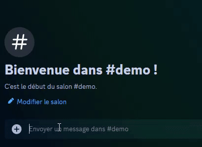

# Minecraft Whitelist Bot

This is a useful Discord.py bot that, with Slash Commands and the DiscordSRV plugin, allows your players to be added to and interact with a Minecraft server's whitelist from within Discord, perfect for semi-public servers or communities.

## Table of Contents
- [Live Demo](#live-demo)
- [Background](#background)
  - [Why not use LuckPerms?](#why-not-use-luckperms)
- [Features](#features)
- [How to Use](#how-to-use)
- [Contributing](#contributing-🤝)
- [Future Plans](#future-plans)
- [License](#license)
- [Acknowledgments](#💖-acknowledgments)

### Live Demo

*Amazing, right?*

## Background
When creating a server for players or a community, it is common to have a whitelist to prevent unwanted players, griefers, or server scanners from joining, and also to maintain a sense of community and security. However, managing a whitelist can be a hassle with players constantly asking for others to be added or removed. 

This bot simplifies the process by being a public bot that can be added to any server by anyone, allowing new people to be added by word-of-mouth.

**The process the bot uses completely solves the issue of the manual hassle whilst upholding the security of the whitelist to be only friends, or friends-of-friends.**

### Why not use LuckPerms?
LuckPerms is a great plugin for managing permissions, however, the scope for allowing users to use `/whitelist` allows users to use all whitelist subcommands, such as `/whitelist remove`, which is not ideal for a public bot as **anyone could remove anyone from the whitelist**. This bot only allows adding and listing players, and removing players is restricted to trusted players or owners.

## Features
- **Slash Commands** - for ease of use, the bot uses Discord's new-ish Slash Commands for clean interactions, and reduces ambiguity.
- **Whitelist Management**:
    - `/add`: anyone can **add** players to the whitelist 
    - `/remove`: trusted players/owners can **remove** players from the whitelist
    - `/list`: **list** all players on the whitelist
- **DiscordSRV Integration** - the popular DiscordSRV plugin's console channel is used as a bridge to the Minecraft server, allowing the bot to issue commands to - and read responses from - the server. This allows for **real-time whitelist updates**.

## How to Use
1. Clone the repository
2. Create a Discord bot and add it to your server with `bot` and `applications.commands` permissions
2. Install the required packages with `pip install -r requirements.txt`
3. Create a `.env` file in the root directory with the following variables:
    - `DISCORD_TOKEN` - your Discord bot token
    - `APPLICATION_ID` - your Discord bot's application ID
    - `DISCORDSRV_CONSOLE_CHANNEL_ID` - the ID of the DiscordSRV console channel
4. In DiscordSRV's `config.yml`, set enable-bots to `true` in the ConsoleChannel section so it takes input from the bot
5. *Optional: there are extra commands such as /ip and /map that can be modified or removed as needed*
6. Run the bot with `python bot.py`
7. Profit!

## Contributing 🤝

1. Fork the repo
2. Create a feature branch (`git checkout -b feature/amazing`)
3. Commit changes (`git commit -am 'Add something amazing'`)
4. Push (`git push origin feature/amazing`)
5. Open a Pull Request that explains the changes and why they are brilliant! 🎉

## Future Plans
I would like to create a plugin in Java that can be added to any server to allow the bot to interact with it, rather than relying on DiscordSRV. This would allow the bot to be used on any server and be more efficient, as it does not have to be run separately.

Perhaps more commands will be added in the future that would be good in this case but LuckPerms is a good plugin for managing permissions anyway.

## License
MIT License.

## 💖 Acknowledgments
- DiscordSRV team for their amazing plugin that myself and many others use every day
- Discord.py community for support <3
